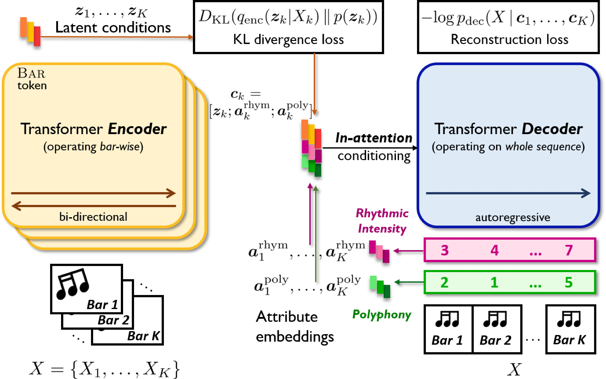

## MuseMorphose, A Transformer-based VAE

* We develop the **in-attention** mechanism to firmly control Transformer decoders with _segment-level_, _dense_ conditions. 
* We then bridge the full song-level **in-attention** decoder and a _bar-wise_ Transformer encoder to construct our **MuseMorphose** model. 
* Trained with the VAE objective alone, **MuseMorphose** can perform style transfer on long musical pieces, while allowing users to control musical attributes down to the bar level.

## Paper
* Shih-Lun Wu, Yi-Hsuan Yang  
**_MuseMorphose_: Full-Song and Fine-Grained Music Style Transfer with Just One Transformer VAE**  
_ArXiv preprint_, May 2021  
[[arXiv](.) (coming soon)] [[code](.) (coming soon)] [[BibTex](.) (coming soon)]

## Brief Technical Overview

  <figure>
    
    

      <figcaption>Model architecture of MuseMorphose</figcaption>
    

  </figure>

**MuseMorphose** is trained on expressive pop piano performances (_AILabs.tw-Pop1.7K_ dataset, [link](https://github.com/YatingMusic/compound-word-transformer/tree/main/dataset)).
A slightly revised Revamped MIDI representation (**REMI**, _Huang and Yang, 2020_, [paper](https://arxiv.org/abs/2002.00212)) is adopted to convert the music into token sequences.

### Controllable Attributes
We consider the following two _computable_, _bar-level_ attributes:
* **Rhythmic intensity**: The percentage of quarter beats with _&ge;1 note onsets_.
* **Polyphony**: The average number of _notes hit or held_ on each quarter beat.  

Following _Kawai et al. (2020)_ ([paper](https://archives.ismir.net/ismir2020/paper/000099.pdf)), for each attribute, we assign each bar an ordinal class from $$[0, 1, \dots, 7]$$ according to the computed raw score.
The attributes are turned into learnable _attribute embeddings_

$$ \boldsymbol{a}^{\text{rhym}}, \boldsymbol{a}^{\text{poly}} \in \mathbb{R}^{d_{\boldsymbol{a}}} $$

fed to the decoder through **in-attention** to control the generation.

We note that more attributes can be potentially included, such as _rhythmic variation_ (ordinal), or _composing styles_ (nominal), just to name a few.

### In-attention Conditioning
To maximize the influence of bar-level conditions (i.e., $$\boldsymbol{c}_k$$'s) on the decoder, we inject them into _all_ $$L$$ self-attention layers through

$$\begin{aligned}
  \tilde{\boldsymbol{h}^l_t} &= \boldsymbol{h}^l_t + {\boldsymbol{c}_k}^{\top} W_{\text{in}} \,, \; \; \; \; \forall \, l \in \{0, L-1\} \; \text{and} \; \forall \, t \in I_k \, \\
  \boldsymbol{c}_k &= \text{concat}([\boldsymbol{z}_k, \boldsymbol{a}^{\text{rhym}}_k, \boldsymbol{a}^{\text{poly}}_k])\, \\
  W_{\text{in}} &\in \mathbb{R}^{d_{\boldsymbol{c}} \times d}; \; \; \; \; \; \; \; \; \tilde{\boldsymbol{h}^l_t}, \boldsymbol{h}^l_t \in \mathbb{R}^{d} \,,
\end{aligned}$$

where $$I_k$$ stores the timestep indices for the $$k^{\text{th}}$$ bar, and $$\tilde{\boldsymbol{h}^l_t}$$'s are the _modified hidden states_ of layer $$l$$.

This mechanism promotes tight control by constantly reminding the model of the conditions' presence.

## Listening Samples
The samples demonstrate that **MuseMorphose** attains high _fidelity_ to the original song, strong _attribute control_, good _diversity_ across generations, and excellent _musicality_, all at the same time.

### 8-bar Excerpt #1  

| &bull; Original (**mid** rhythm & polyphony) | <audio controls><source src="./assets/audio_samples/excerpt01_orig.mp3" type="audio/mpeg"></audio> |
| --- | ----------- |
| &bull; Generation #1, **high** rhythm & polyphony | <audio controls><source src="./assets/audio_samples/excerpt01_high.mp3" type="audio/mpeg"></audio> |
| &bull; Generation #2, **ascending** rhythm & polyphony | <audio controls><source src="./assets/audio_samples/excerpt01_crescendo.mp3" type="audio/mpeg"></audio> |
| &bull; Generation #3, **descending** rhythm & polyphony | <audio controls><source src="./assets/audio_samples/excerpt01_diminuendo.mp3" type="audio/mpeg"></audio> |

### 8-bar Excerpt #2  

| &bull; Original (**mid** rhythm & polyphony) | <audio controls><source src="./assets/audio_samples/excerpt02_orig.mp3" type="audio/mpeg"></audio> |
| --- | ----------- |
| &bull; Generation #1, **low** rhythm & polyphony | <audio controls><source src="./assets/audio_samples/excerpt02_low.mp3" type="audio/mpeg"></audio> |
| &bull; Generation #2, **high** rhythm, **ascending** polyphony | <audio controls><source src="./assets/audio_samples/excerpt02_poly_crescendo.mp3" type="audio/mpeg"></audio> |
| &bull; Generation #3, **descending** rhythm, **high** polyphony | <audio controls><source src="./assets/audio_samples/excerpt02_rhym_diminuendo.mp3" type="audio/mpeg"></audio> |

## Authors and Affiliations

  
  
  

